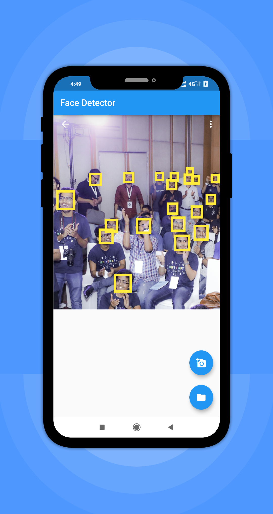

# Face Detection Using Firebase ML-Kit

## Steps
 1. First create a Firebase project and add the image_picker and firebase_ml_vision dependencies.             
 2. Use image_picker to get the image from camera/gallery & convert it into a format that can be understood by ML Kit.
 3. Pass the converted image to the detector and get it to scan the image for possible faces.
 4. The face detector will return a list of Face class which contains the Rect coordinates.
 5. The Painter will then use these coordinates to draw a rectangular box around the faces using these coordinates
